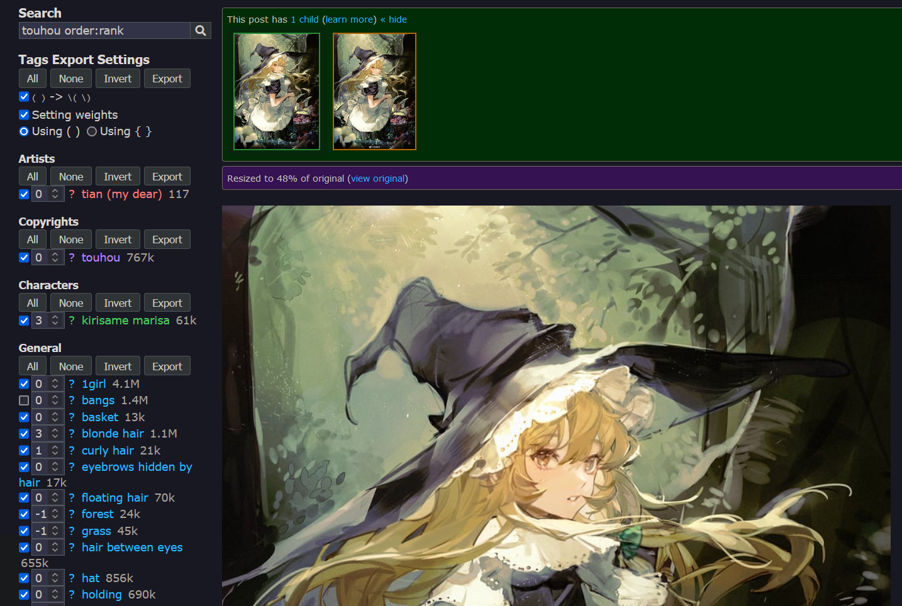

<h1> Danbooru Tags Exporter</h1>

Select specified tags and copy to clipboard, for Stable Diffusion WebUI or NovelAI to use.

## Screenshoot

Will be exported as `tian \(my dear\), touhou, (((kirisame marisa))), 1girl, basket, (((blonde hair))), (curly hair), eyebrows hidden by hair, floating hair, [forest], [grass], hair between eyes, hat, holding, holding basket, long hair, looking at viewer, looking back, nature, solo, squatting, tree, witch, witch hat, yellow eyes`

> For display function only, the source of the picture is https://pixiv.net/artworks/102093005, thanks.

## License

The AGPL-3.0 License.
